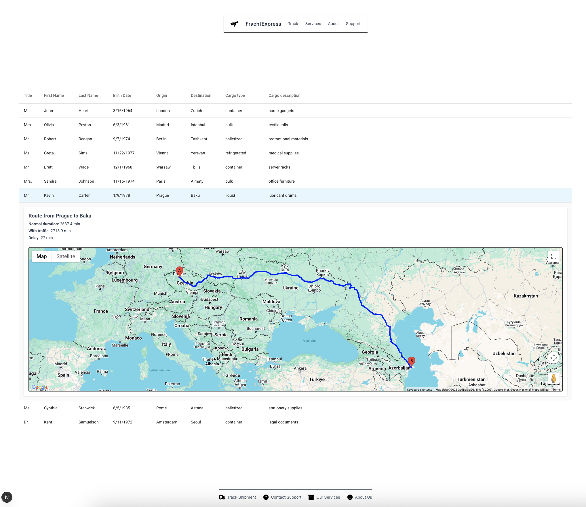

# 📚 Freight Management Platform using @temporalio

This project demonstrates a freight delay alerting system that combines:

* ⏱ Real-time traffic delay calculations
* 🧠 OpenAI-generated WhatsApp notifications
* 🔄 Event orchestration using [Temporal](https://temporal.io/)
* 🗘 Google Maps route visualization

---

## 🚀 Project Launch Instructions

1. **Rename and configure environment variables:**

```bash
mv .env.example .env
```

Update `.env` with your actual API keys:

```env
NEXT_PUBLIC_TRAFFIC_API_KEY=your_traffic_api_key
OPENAI_API_KEY=your_openai_api_key
TWILIO_ACCOUNT_SID=your_twilio_sid
TWILIO_AUTH_TOKEN=your_twilio_auth_token
TWILIO_PHONE_NUMBER=your_twilio_phone_number
QUEUE_NAME=DELIVERY_DELAYS_QUEUE
DELAY_THRESHOLD=30
NAMESPACE=default
CONNECTION_ADDRESS=localhost:7233
```

---

## ⚙️ Requirements

* **Node.js** v22 or higher
* **pnpm** installed globally
* **Temporal CLI** (install via Homebrew or official docs)

---

## 📦 Install Dependencies

```bash
pnpm install
```

---

## 🧠 Start the Temporal Server (Dev Mode)

```bash
brew install temporal
temporal server start-dev
```

---

## ⚙️ Run Workers

```bash
pnpm run start-worker
```

---

## 💻 Start the App

```bash
pnpm run dev
```

Navigate to: [http://localhost:3000](http://localhost:3000)

---

## 🧪 Run Tests

```bash
pnpm run test
```

---

## 🧱 Project Structure Overview

```text
freight-delay-app/
├── public/
└── src/
    ├── app/
    │   └── traffic/
    ├── components/
    ├── lib/
    │   ├── temporal/
    │   │   ├── workflows/
    │   │   ├── activities/
    │   │   ├── worker/
    │   │   └── interfaces/
    │   ├── logger/
    │   └── utils/
    └── pages/
        └── api/
├── .env.example
├── package.json
├── tsconfig.json
└── ...
```

---

## 📘 App Features & Logic

### 🔄 Temporal Activities

**Location:** `lib/temporal/activities.ts`

* Fetches traffic data from Mapbox or Google Maps.
* Calculates delivery delay.
* Handles message generation logic.

### 📋 Workflow

**Location:** `lib/temporal/workflows.ts`

* Orchestrates activities using Temporal.
* Accepts `origin`, `destination`, and `contact` as parameters.

### 🧵 Worker Process

**Location:** `lib/temporal/worker.ts`

* Registers and executes activities.
* Runs as a standalone Temporal service.

---

### 🗘 Next.js Page: `app/traffic/page.tsx`

This page displays a real-time traffic dashboard with:

* ✅ **Interactive Table**: Click on any row to expand a **Google Map view** showing the polyline route and delay computation.
* 📍 **Delay Handling**:

  * If the delay is greater than **30 minutes**:

    * 🧠 A WhatsApp message is automatically **generated using OpenAI**.
    * 📬 The message is sent via **Twilio**, and a reference ID is attached.
